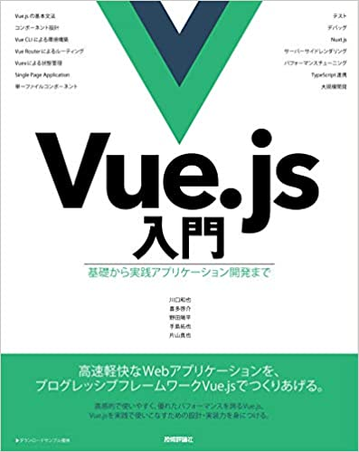
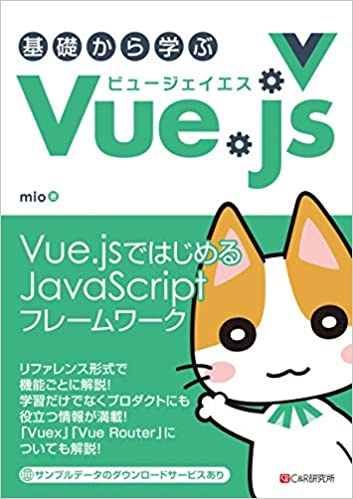

# vue 学習記録

# 参考サイト

- [Vue.js 公式](https://jp.vuejs.org/)

- [開発者向けのウェブ技術](https://developer.mozilla.org/ja/docs/Web)

## Vuex（Vue.js アプリケーションのための 状態管理パターン + ライブラリ）

- [Vuex 公式サイト](https://vuex.vuejs.org/ja/)

## vue-cli（Standard Tooling for Vue.js Development）

- [vue-cli 公式サイト](https://cli.vuejs.org/)
- [Qiita:Vue.js を vue-cli を使ってシンプルにはじめてみる](https://qiita.com/567000/items/dde495d6a8ad1c25fa43)

## Vue Test Utils （Vue.js 向けの公式単体テストライブラリ）

- [vue-test-utils 公式サイト](https://vue-test-utils.vuejs.org/ja/)
- [Jest 公式サイト](https://jestjs.io/ja/)

## Nuxt.js (Vue.js フレームワーク SPA の構築などに使われる)

- [Nuxt.js 公式（日本語）](https://ja.nuxtjs.org/)
- [リファレンス](https://ja.nuxtjs.org/api/)

# 参考書籍

Vue.js 入門 基礎から実践アプリケーション開発まで 川口 和也  
https://www.amazon.co.jp/dp/4297100916/ref=cm_sw_r_tw_dp_U_x_BH9MEbTFZV38N

基礎から学ぶ Vue.js  
https://www.amazon.co.jp/dp/4863542453/ref=cm_sw_r_tw_dp_U_x_UC9MEb8954GPZ

# ブランチ（学習内容ごとに作成している）

- learning/vue.js 入門　：Vue.js 基本機能
- Vuex の学習：Vuex を使用したタスク管理アプリケーション
- Vuex Shopping Cart：Vuex を使用したショッピングカート
- kanban-app：カンバン方式のタスク管理アプリケーション
- vue-test-utils：Vue Test Utils の学習
- Nuxt:Nuxt.js の学習
